# Phase 14–16 知识图谱：Agent 工程 → 自主系统 → 多智能体与群体

> 本图谱覆盖 **89 课时**，从单智能体核心能力，到自主进化与安全边界，再到多智能体协作与群体智能。
> 所有 Mermaid 代码可直接粘贴到支持 Mermaid 的渲染器中查看（GitHub / VS Code / Notion / Obsidian）。

---

## 目录

1. [全景总览](#1-全景总览)
2. [Phase 14：Agent Engineering 详细图谱](#2-phase-14agent-engineering-详细图谱)
3. [Phase 15：Autonomous Systems 详细图谱](#3-phase-15autonomous-systems-详细图谱)
4. [Phase 16：Multi-Agent & Swarms 详细图谱](#4-phase-16multi-agent--swarms-详细图谱)
5. [跨阶段依赖关系](#5-跨阶段依赖关系)
6. [知识簇概览表](#6-知识簇概览表)
7. [建议学习路径](#7-建议学习路径)

---

## 1. 全景总览

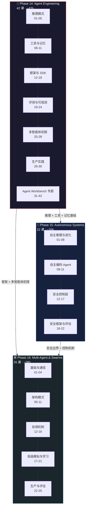

---

## 2. Phase 14：Agent Engineering 详细图谱

### 2.1 推理模式（课程 01-05）

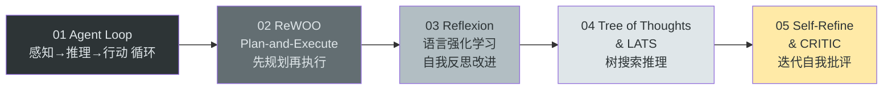

**核心思想**：从最简单的循环（Observe-Think-Act），逐步引入规划、反思、树搜索、自批评等高级推理策略。

### 2.2 工具与记忆（课程 06-11）

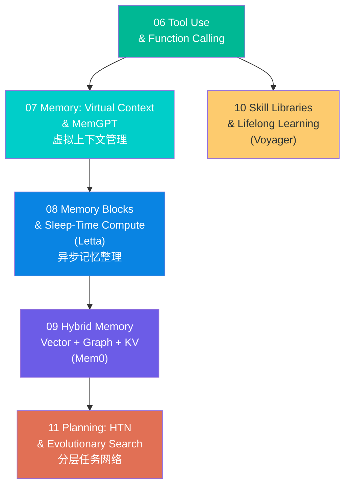

**核心思想**：工具是 Agent 的手，记忆是 Agent 的大脑——从单工具调用到复合记忆系统，从即时技能到终身学习。

### 2.3 框架与 SDK（课程 12-18）

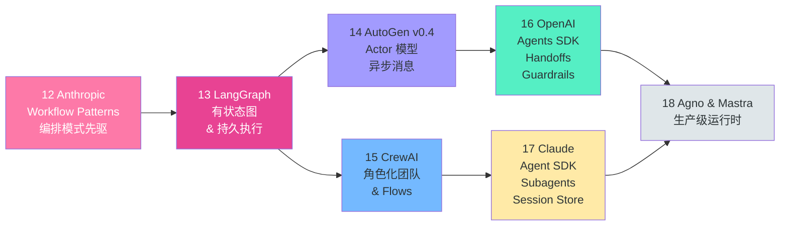

**核心思想**：理解主流 Agent 框架的设计哲学——图编排（LangGraph）、Actor 模型（AutoGen）、角色协作（CrewAI）、Handoff 模式（OpenAI SDK）。

### 2.4 评测与可观测（课程 19-24）

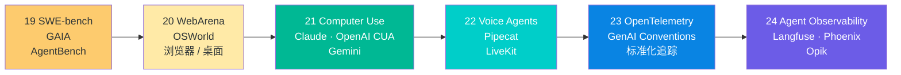

**核心思想**：如何衡量 Agent 的能力？从代码基准（SWE-bench）到交互环境（WebArena），再到标准化可观测性。

### 2.5 多智能体初探 + 生产实践（课程 25-30）

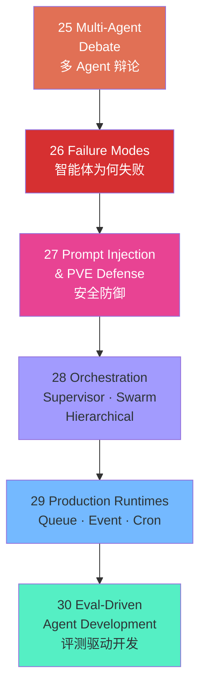

### 2.6 Agent Workbench 专题（课程 31-42）

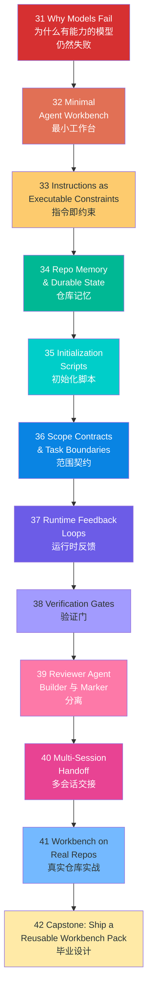

**核心思想**：这是 Phase 14 的巅峰——12 节课逐步构建一个完整的 Agent 工作台，覆盖从"为什么失败"到"如何在真实仓库中可靠运行"的全链路。

---

## 3. Phase 15：Autonomous Systems 详细图谱

### 3.1 自主推理与进化（课程 01-08）

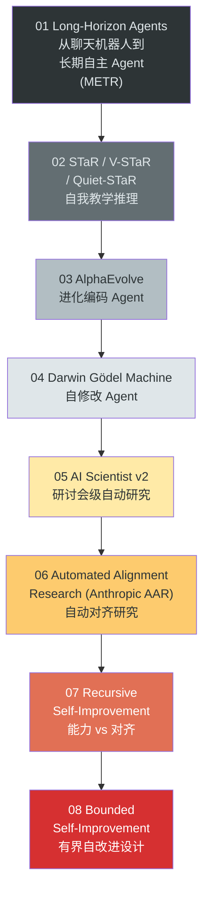

**核心思想**：从"长时间运行"到"自我改进"——Agent 不再只是执行任务，而是进化自身。递归自改进是能力的顶峰，也是风险的起点。

### 3.2 自主编码 Agent（课程 09-11）

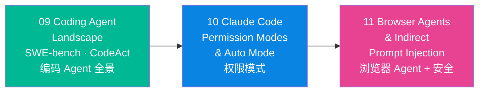

**核心思想**：自主 Agent 的两个核心应用场景——代码编写和浏览器操作，各自带来独特的安全挑战。

### 3.3 安全控制层（课程 12-17）

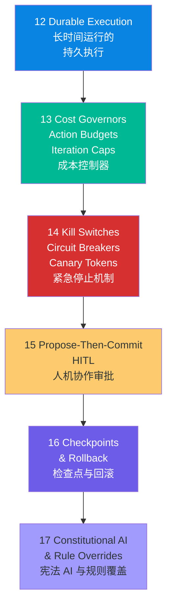

**核心思想**：自主性越强，安全控制越重要。这一层是"放手"与"拉缰"之间的工程平衡——成本封顶、紧急刹车、人工审批、状态回滚、规则约束。

### 3.4 安全框架与评估（课程 18-22）

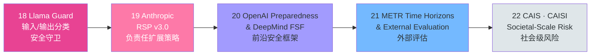

**核心思想**：从模型级安全（Llama Guard）到机构级策略（RSP/FSF），再到社会级风险评估（CAIS/CAISI），理解安全的多个层次。

---

## 4. Phase 16：Multi-Agent & Swarms 详细图谱

### 4.1 基础与通信（课程 01-04）

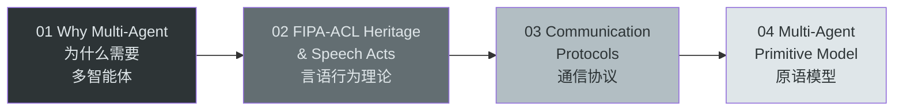

**核心思想**：多智能体不是简单地复制单个 Agent——它需要通信协议、言语行为理论和统一的原语模型作为基础。

### 4.2 架构模式（课程 05-11）

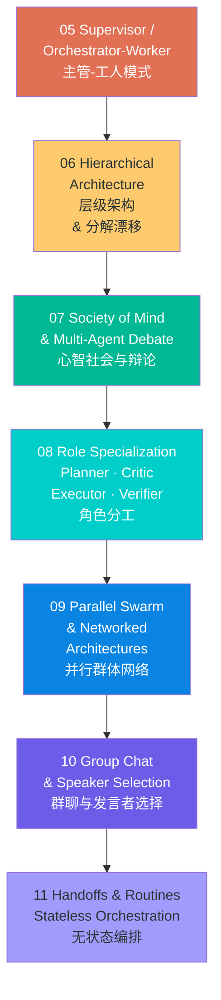

**核心思想**：7 种架构模式——从最简单的主管派活（Supervisor），到复杂的无状态编排（Handoffs），每种模式适用于不同场景。

### 4.3 协调机制（课程 12-16）

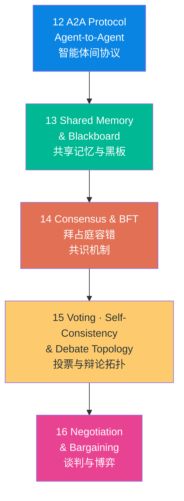

**核心思想**：当多个 Agent 需要达成一致时，需要协议（A2A）、共享状态（Blackboard）、容错共识（BFT）、投票决策和谈判博弈。

### 4.4 高级模拟与学习（课程 17-21）

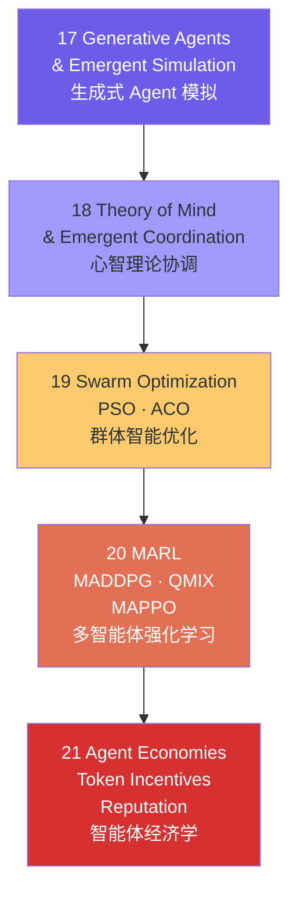

**核心思想**：从模拟人类社会（Generative Agents），到经典群体优化（PSO/ACO），再到深度多智能体强化学习（MARL），最终引入经济激励机制。

### 4.5 生产与评估（课程 22-25）

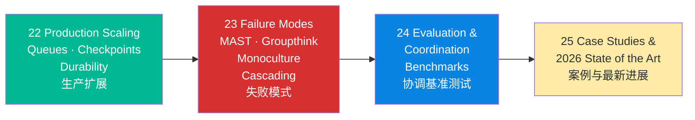

---

## 5. 跨阶段依赖关系

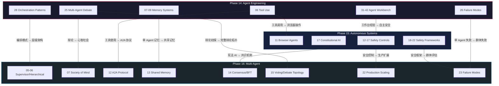

---

## 6. 知识簇概览表

### Phase 14：Agent Engineering（智能体工程）

| 知识簇 | 课程编号 | 核心主题 | 关键概念 |
|--------|---------|---------|---------|
| 推理模式 | 01-05 | Agent 推理策略 | Agent Loop, ReWOO, Reflexion, ToT/LATS, Self-Refine, CRITIC |
| 工具与记忆 | 06-11 | 外部能力接入 | Function Calling, MemGPT, Letta, Mem0, Voyager, HTN, 进化搜索 |
| 框架与 SDK | 12-18 | 工程化框架 | Anthropic Patterns, LangGraph, AutoGen, CrewAI, OpenAI SDK, Claude SDK, Agno, Mastra |
| 评测与可观测 | 19-24 | 质量保障 | SWE-bench, GAIA, WebArena, OSWorld, Computer Use, Voice Agents, OTel, Langfuse |
| 多智能体初探 | 25-28 | 协作与安全 | Multi-Agent Debate, Failure Modes, Prompt Injection, Orchestration |
| 生产实践 | 29-30 | 上线运维 | Production Runtimes, Eval-Driven Dev |
| Agent Workbench | 31-42 | 工作台全流程 | 可执行约束, 仓库记忆, 范围契约, 验证门, Reviewer Agent, Capstone |

### Phase 15：Autonomous Systems（自主系统）

| 知识簇 | 课程编号 | 核心主题 | 关键概念 |
|--------|---------|---------|---------|
| 自主推理与进化 | 01-08 | 能力递进 | Long-Horizon, STaR, AlphaEvolve, Darwin Gödel, AI Scientist, AAR, 递归/有界自改进 |
| 自主编码 Agent | 09-11 | 代码与浏览器 | SWE-bench, CodeAct, Claude Code, Browser Agents, 间接注入 |
| 安全控制层 | 12-17 | 控制机制 | Durable Execution, Cost Governors, Kill Switches, HITL, Checkpoints, Constitutional AI |
| 安全框架与评估 | 18-22 | 制度保障 | Llama Guard, RSP, Preparedness/FSF, METR, CAIS/CAISI |

### Phase 16：Multi-Agent & Swarms（多智能体与群体）

| 知识簇 | 课程编号 | 核心主题 | 关键概念 |
|--------|---------|---------|---------|
| 基础与通信 | 01-04 | 理论根基 | Why Multi-Agent, FIPA-ACL, Speech Acts, 通信协议, 原语模型 |
| 架构模式 | 05-11 | 拓扑设计 | Supervisor, Hierarchical, Society of Mind, Role Specialization, Parallel Swarm, Group Chat, Handoffs |
| 协调机制 | 12-16 | 一致性达成 | A2A, Shared Memory, Consensus/BFT, Voting, Negotiation |
| 高级模拟与学习 | 17-21 | 涌现与优化 | Generative Agents, Theory of Mind, PSO/ACO, MARL, Agent Economies |
| 生产与评估 | 22-25 | 落地实战 | Production Scaling, Failure Modes, Benchmarks, Case Studies 2026 |

---

## 7. 建议学习路径

### 路径 A：快速入门（推荐，~30h）

如果你想快速掌握 Agent 工程的核心能力，按此路径学习：

```
Phase 14 推理模式 (01-05)
    ↓
Phase 14 工具与记忆 (06-11)
    ↓
Phase 14 框架选一 (13 LangGraph 或 16 OpenAI SDK)
    ↓
Phase 15 安全控制层 (12-17) ← 理解安全边界
    ↓
Phase 16 架构模式 (05-11) ← 理解多 Agent 编排
    ↓
Phase 14 Agent Workbench (31-42) ← 综合实战
```

### 路径 B：全面深入（完整，~90h）

按顺序完成所有 89 课时：

```
Phase 14 全部 (01-42)    ← 建立完整的 Agent 工程基础
    ↓
Phase 15 全部 (01-22)    ← 理解自主性与安全边界
    ↓
Phase 16 全部 (01-25)    ← 掌握多智能体协作与群体智能
```

### 路径 C：按主题横向学习

| 主题 | 路径 |
|------|------|
| **记忆系统** | P14-07 → P14-08 → P14-09 → P16-13 |
| **安全与对齐** | P14-27 → P15-14 → P15-15 → P15-17 → P15-18 → P16-14 |
| **编排模式** | P14-28 → P16-05 → P16-06 → P16-07 → P16-08 → P16-11 |
| **评测基准** | P14-19 → P14-20 → P15-21 → P16-24 |
| **生产落地** | P14-29 → P15-12 → P16-22 |
| **自改进** | P15-02 → P15-03 → P15-04 → P15-05 → P15-06 → P15-07 → P15-08 |

---

## 附录：关键术语速查

| 术语 | 含义 | 首次出现 |
|------|------|---------|
| Agent Loop | 感知→推理→行动的循环 | P14-01 |
| ReWOO | Reasoning Without Observation，先规划再执行 | P14-02 |
| Reflexion | 通过语言反思进行自我改进 | P14-03 |
| ToT | Tree of Thoughts，树搜索推理 | P14-04 |
| LATS | Language Agent Tree Search，语言 Agent 树搜索 | P14-04 |
| MemGPT | 虚拟上下文管理的 Agent 记忆系统 | P14-07 |
| HTN | Hierarchical Task Network，分层任务网络 | P14-11 |
| OTel | OpenTelemetry，可观测性标准 | P14-23 |
| STaR | Self-Taught Reasoner，自我教学推理 | P15-02 |
| AlphaEvolve | 进化式编码 Agent | P15-03 |
| Darwin Gödel Machine | 能自修改的 Agent 架构 | P15-04 |
| RSP | Responsible Scaling Policy，负责任扩展策略 | P15-19 |
| METR | Model Evaluation & Threat Research，模型评估与威胁研究 | P15-21 |
| FIPA-ACL | 基金会智能物理 Agent 通信语言 | P16-02 |
| A2A | Agent-to-Agent Protocol，智能体间协议 | P16-12 |
| BFT | Byzantine Fault Tolerance，拜占庭容错 | P16-14 |
| MARL | Multi-Agent Reinforcement Learning，多智能体强化学习 | P16-20 |
| PSO | Particle Swarm Optimization，粒子群优化 | P16-19 |
| ACO | Ant Colony Optimization，蚁群优化 | P16-19 |
| MAST | Multi-Agent Systemic Thinking failure，多智能体系统性失败 | P16-23 |